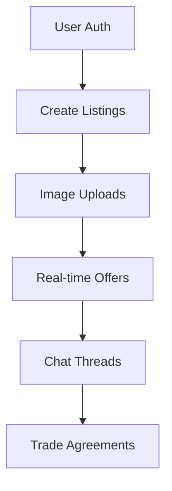

# 🔄 Barter Marketplace

**A cashless trading platform where goods/services find new owners**

*Replace with actual screenshot*

---

## 🚀 Why I Built This

Nigeria lacks dedicated platforms for cashless trading. This solves:

* ✅ **Monetizing unused items** without cash transactions
* ✅ **Community resource sharing** through swaps
* ✅ **Service-for-goods exchanges** (e.g. "I'll design your logo for your old monitor")

---

## 🛠 Tech Stack Deep Dive

| Area      | Tech Choices            | Why?                                                |
| --------- | ----------------------- | --------------------------------------------------- |
| Frontend  | Next.js 14 (App Router) | SSR, optimized routing, and React Server Components |
| State     | Zustand                 | Simple global state for UI preferences              |
| Database  | MongoDB + Prisma        | Flexible schema for dynamic listings                |
| Real-Time | Socket.IO               | Persistent 1:1 chat channels                        |
| Storage   | Cloudinary              | Optimized image uploads/transformations             |
| Auth      | NextAuth.js             | Secure authentication with email + OAuth            |

---

## ✨ Key Features

---

## 🧠 Lessons Learned

1. **WebSocket Scaling**: Had to implement room-based architecture when testing with 50+ concurrent users
2. **Optimistic UI**: Implemented rollback states for failed trade offers
3. **MongoDB Optimization**: Created compound indexes for geolocation-based listing searches

---

## 📈 Future Roadmap

* [ ] Mobile app (React Native)
* [ ] Reputation system
* [ ] Barter credit points

---

## 👋 For Recruiters

I'm currently exploring opportunities as a **Full-stack Developer**. This project demonstrates:

* **Problem-solving**: Identified local market gap
* **Full-stack chops**: From DB design to pixel-perfect UI
* **Architecture skills**: See `/docs/ARCHITECTURE.md`

📫 **Let's connect**: [emmanuelobiora11@gmail.com](mailto:emmanuelobiora11@gmail.com)
🔗 [LinkedIn](https://www.linkedin.com/in/emmanuel-obiora-9b8495192/)
