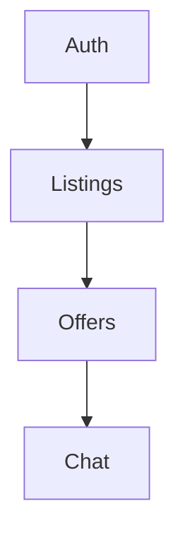

### 🔄 Barter Marketplace  
**A cashless trading platform where goods/services find new owners**  

 

---

  
*Clean interface showing trade listings and chat*

---

### 🚀 Why I Built This  
Nigeria lacks dedicated platforms for cashless trading. This solves:  
- ✅ **Monetizing unused items** without cash  
- ✅ **Community resource sharing** through swaps  
- ✅ **Service-for-goods exchanges**  

---

### 🛠 Tech Stack  
| Area | Tech | Purpose |  
|-------|-------|---------|  
| Frontend | Next.js 14 | SSR + optimized routing |  
| Database | MongoDB | Flexible schema |  
| Realtime | Socket.IO | Live chat |  

---

---

### 📈 Roadmap  
- [ ] Mobile app  
- [ ] Reputation system  
- [ ] Barter credits  

---

### 👋 For Recruiters  
**Demonstrates:**  
🔧 Full-stack capabilities  
💡 Problem-solving  
🌍 Local market understanding  

📫 **Contact:** [email](mailto:emmanuelobiora11@gmail.com)  
🔗 **Connect:** [LinkedIn](https://linkedin.com/in/emmanuel-obiora)  

---